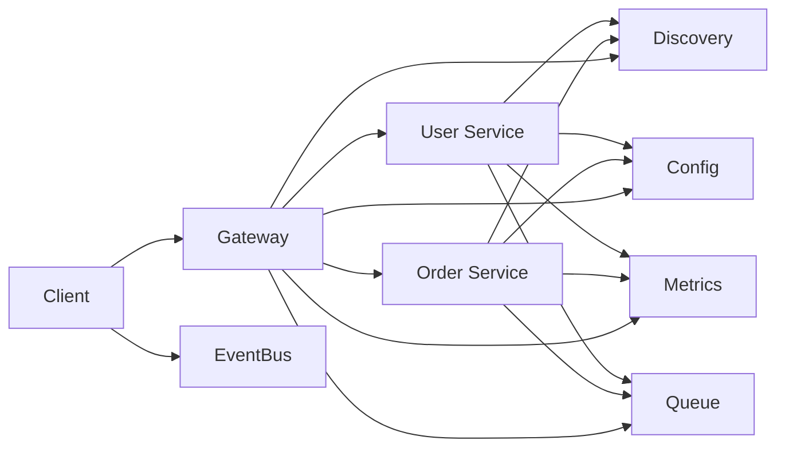

# kislayphp showcase

Microservices showcase for the KislayPHP extension suite.

This repo demonstrates:

- Core HTTP server
- Gateway
- Discovery
- Config
- Metrics
- Queue
- EventBus

## Architecture



## Structure

- shared/
  - common.php
- services/
  - user/index.php
  - order/index.php
- gateway/
  - index.php
- eventbus/
  - index.php
- worker/
  - index.php

## Requirements

Build the extensions in this repo and run with PHP:

- `kislayphp_extension`
- `kislayphp_gateway`
- `kislayphp_discovery`
- `kislayphp_config`
- `kislayphp_metrics`
- `kislayphp_queue`
- `kislayphp_eventbus`
- PHP Redis extension (`redis`) for discovery storage

## Run

From the repo root:

```sh
PHP_EXTS="-d extension=https/modules/kislay_extension.so \
-d extension=kislayphp_gateway/modules/kislayphp_gateway.so \
-d extension=kislayphp_discovery/modules/kislayphp_discovery.so \
-d extension=kislayphp_config/modules/kislayphp_config.so \
-d extension=kislayphp_metrics/modules/kislayphp_metrics.so \
-d extension=kislayphp_queue/modules/kislayphp_queue.so \
-d extension=kislay_socket/modules/kislay_socket.so"
```

Start services (separate terminals):

```sh
php $PHP_EXTS kislayphp/services/user/index.php
php $PHP_EXTS kislayphp/services/order/index.php
php $PHP_EXTS kislayphp/gateway/index.php
```

Optional: start EventBus:

```sh
php $PHP_EXTS kislayphp/eventbus/index.php
```

Optional: run queue worker:

```sh
php $PHP_EXTS kislayphp/worker/index.php
```

## Try It

```sh
curl http://localhost:8081/users
curl http://localhost:8081/orders
curl -X POST http://localhost:8081/orders -d "item=chair&qty=1"
```

## Notes

- Discovery uses Redis via a custom client in `shared/redis_discovery.php`.
- Config, Metrics, and Queue are in-memory for the showcase. For real distributed microservices, provide custom clients via the module interfaces.
- Gateway routes are exact matches for clarity.

## Redis Config

Set these env vars for discovery storage:

- `KISLAY_REDIS_HOST` (default `127.0.0.1`)
- `KISLAY_REDIS_PORT` (default `6379`)
- `KISLAY_REDIS_DB` (default `0`)
- `KISLAY_REDIS_PASSWORD` (default empty)
- `KISLAY_REDIS_PREFIX` (default `kislay:discovery`)

